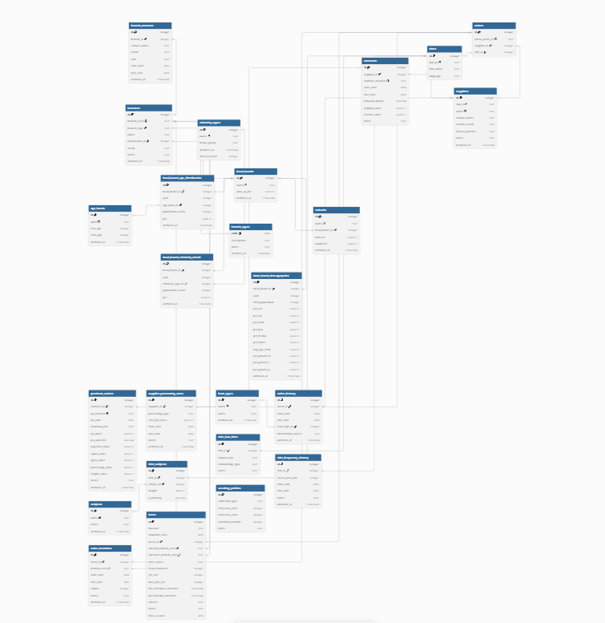

# Serials Analysis #

## Project summary ##
Integrating demographic insights from StatsNZ and local board data with internal cost and circulation records to optimise serials procurement.

## Architecture ##

<<<<<<< Updated upstream

=======

>>>>>>> Stashed changes

erDiagram
    local_boards ||--o{ branches : "contains"
    local_boards ||--o{ suburbs : "contains"
    branches ||--o{ branch_contacts : "employs"
    branches ||--o{ branch_history : "records"
    suppliers ||--o{ contracts : "holds"
    contracts ||--o{ purchase_orders : "executes"
    orders ||--o{ order_history : "tracks"
    titles ||--o{ orders : "includes"
    titles ||--o{ title_subjects : "categorized_by"
    subjects ||--o{ title_subjects : "defined_in"

## Core components ##
- [Census integration](./census-integration/README.md)   
- [Collection analytics](./collection-analytics/README.md)
- [Data pipelines](./data-pipelines/README.md)

## Data dictionary ##

### Data schema conventions ###
To ensure consistency across the data warehouse, the following attributes are present in most tables:

- id: Primary Key (Serial)
- notes: Text field for context
- archived_at: Timestamp (Null = Active, Present = Archived/Soft-deleted)

### 1. Acquisitions and procurement ###
*Systems for managing supplier contracts, purchase order lifecycles and expenditure*

| Table | Primary Fields | Key Relationship |
|-------|----------------|------------------|
| `suppliers` | `name`, `sap_id` | Parent for all procurement |
| `contracts` | `contract_number`, `current_value` | Ties suppliers to funding |
| `purchase_orders` | `po_value`, `capex_value` | The execution layer |

<strong> View detailed dictionary </strong>

_Financial vs. operational hierarchy_
- Contracts: Overarching financial agreement betwen library and supplier. Defines the total budget available over time.
- Purchase orders (POs): The annual allocation of funds from total contract value into specific financial years
- Orders: The operational unit representing the annual subscriptions for a particular title, linked back to PO for budget reconciliation.

| Column | Type | Description |
|--------|------|-------------|
| `sap_id` | text | SAP-integrated supplier identifier |
| `invoice_pattern` | text | Regex/Logic pattern for invoice processing |
| `purchase order` | text |  |
| `order` | text | Regex/Logic pattern for invoice processing |
| `capex_value` | numeric | Capital expenditure portion of total PO value; includes VAS and spend for non-lending items |
| `opex_value` | numeric | Opex expenditure portion of total PO value; most circulating collections |

*(Standard global fields `id`, `notes`, `archived_at` apply)*

### 2. Collection and bibliographic ###
<<<<<<< Updated upstream
=======
*Bibliographic metadata and properties specific to titles*
>>>>>>> Stashed changes
| Table | Primary Fields | Key Relationship |
|-------|----------------|------------------|
| `titles` | `title_name`, `bib_no`, `language`, `frequency`, | For calculating unit cost, language and script information |
| `title_issn_links` | `title`, `related issn`, `relationship` | Order information can be tracked items if a title changes name mid subscription |
| `order_locations` | `order_id`, `branch_code` | Current allocations of a given title |
| `title_subjects` | `title`, `subject_id`, 'primary' | Useful to track subject gaps and popularity across branches |

Click to view: Collection and bibliographic metadata

| Column | Type | Description |
|--------|------|-------------|
| `bib_no` | text | Unique library management system identifier |
| `frequency` | int | Number of issues per year, used to calculate cost and weeding rules |
| `branch_code` | int | Unique library branch identifier  |
| `subject_id` | int | Subject codes, repeatable field |

*(Standard global fields `id`, `notes`, `archived_at` apply)*

<<<<<<< Updated upstream
### Circulation and logistics ###
=======
### 3. Circulation and logistics ###
*Systems for tracking movement of material through the system and tracking relative popularity*

>>>>>>> Stashed changes
| Table | Primary Fields | Key Relationship |
|-------|----------------|------------------|
| `items` | `barcode`, `volume`, `location`, `checkout data`, `status` | Trace use and movement across system|
| `orders` | `order number`, `copies`, `fund` | The subscription cost and number of circulating copies |

 Click to view: Circulation and logistics

| Column | Type | Description |
|--------|------|-------------|
| `fund` | text | Fund allocation specific to individual subscription |
| `ytd_circ` | int | Number of checkouts in current FY (excludes renewals) |
| `barcode` | text | Primary key and unique identifier for circulating items; used in preference to system identifier. |
| `status` | text | Current state of item - available, in transit, missing, staff assessment, on hold, on loan etc |

*(Standard global fields `id`, `notes`, `archived_at` apply)*

<<<<<<< Updated upstream
### Demographics ###
=======
### 4. Demographics ###

*StatsNZ and council data about populations across Auckland*

>>>>>>> Stashed changes
| Table | Primary Fields | Key Relationship |
|-------|----------------|------------------|
| `local_boards` | `name`, `area_sq_km` | Base geographic unit for analysis |
| `local_board_demographics` | `ethnicities`, `mean age`, `gender identity` | Overview of population |
| `local_board_metrics` | `local board id`, `metric id`, `metric value`, `year` | Scalable, snapshots of granular local board statistics |

 Click to view: Demographic data

| Column | Type | Description |
|--------|-------|------------|
| `total_population` | int | Total population of board |
| `year` | int | Year that data was taken |
| `pct_*` | int | Percentage of local board population in demographic category - broad ethnic group, gender |
| `age_band` | text | Granular age data in five year brackets |
| `longitude `, `latitude ` | number | Approximate coordinates of local board for tracking coverage 

<<<<<<< Updated upstream
### Governance and policy ###
=======
### 5. Governance and policy ###

*Systems for managing collection lifecycle and (re)distribution*

>>>>>>> Stashed changes
| Table | Primary Fields | Key Relationship |
|-------|----------------|------------------|
| `weeding` | `name`, `sap_id` | Retention guidelines |
| `branch_contacts` | `name`, `email`, `current_role` | Record of who manages the local branch serials collection |
| `branch_capability` | `supports_community_lang_mags etc` | Track which branches hold particular magazine sub-collections |
| `branch_history` | `mag_capacity`, `close_date`, `reopen_date` | Manage distribution changes when branches close or move to temporary locations |

 Click to view: Governance and policy

| Column | Type | Description |
|--------|------|-------------|
| `mag_capacity` | int | Approximate number of titles the branch comfortably holds |
| `retention_months` | int | Derived from collection type and frequency of issues; when items should be discarded |
| `close_date, reopen_date` | dates | The dates a branch will be in a temporary location or closed; important for managing redistribution of serials |
| `start_date, end_date` | dates | Internal guidelines for when to reallocate serials, and when to begin storing them again for reopening |

*(Standard global fields `id`, `notes`, `archived_at` apply)*

