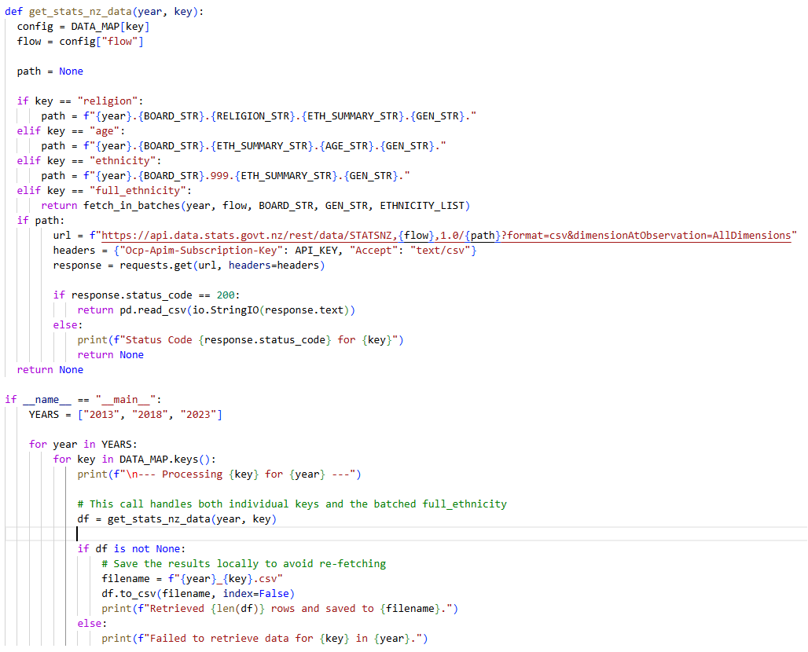
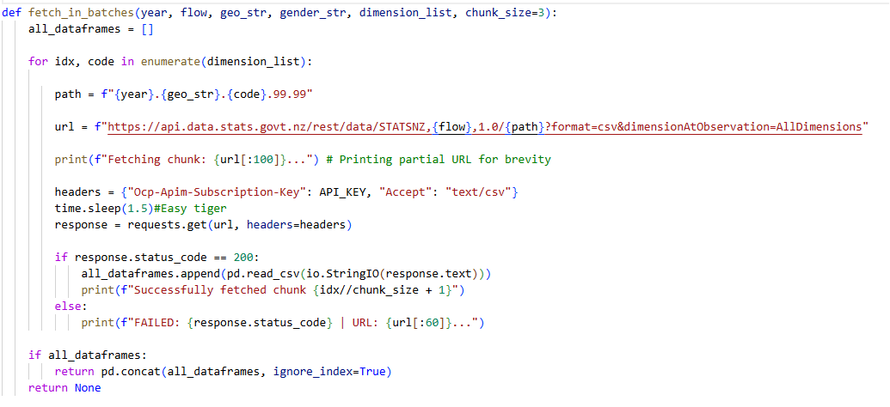
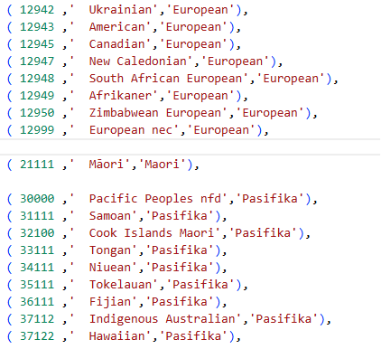

# Census data integration: strategic collection management #

## The problem - the 'unreliable narrator' ##

Library Management Systems (LMS) are often limited by incomplete or degraded data. Borrowing records are transient, and user-provided profile data is often incomplete, outdated, or takes creative license. Without external context, a library is essentially 'shooting blind' when trying to understand the demographics of the population it serves.

## The solution - external demographic profiling ##

Rather than relying on flawed internal user data, with the attendant problems of privacy management, I built a system to cross-reference branch locations with StatsNZ census data. This provides an objective, demographic snapshot independent of individual library users. The purpose of this project is to discover unmet community needs as much as ensure effective collection distribution. By using data external to the library system, reports can suggest populations who are not engaging with the library at all.

## Architectural approach ##

This integration informs collection strategy by cross-referencing circulation data with local demographic data. 

To ensure consistency across the years measured, I used StatsNZ's data cubes. This avoided the risk of 'definitions creep' where census categories and coding shifts over time. The data cubes provided a stable framework for multi-year comparison.

**Data sourcing**

I used the [Aotearoa Data Explorer](https://explore.data.stats.govt.nz/) API to capture multi-year census data from 2013, 2018 and 2023 (CEN23_ECI_17/18).

**Normalisation logic**

  - _Abstraction_: Census categories (e.g. specific ethnicities) are mapped to broader analytical groups to facilitate trend reporting.

  - _Granularity_: A batched retrieval system automated collection of specific language/cultural subsets that can inform collection planning.
  
  - _Future-proofing_: Tables are designed to handle shifting census definitions and multi-year comparisons so that the tool remains relevant as new data is released.

## Technical implementation ##  

**Automated retrieval**

_Retrieval logic is modularised so that queries cycle through year, location and demographic data points._

**Batched retrieval of large datasets**

_For complicated enquiries such as reporting the 180+ possible ethnic groups, I implemented a delay to prevent 429 errors due to exceeding the API rate limits._

**Data mapping** 

_By including broader ethnic category in the ethnicity table, it can be used for general demographics (Asian, Pasifika etc) or to individual cultural identity. Age bands are treated similarly._

## Outcomes and planned improvements ##
**Current state**

- The tool successfully retrieves and maps core demographic determinants (population, age, ethnicity)

**Planned expansions**
  - Integrate religious demographic data for gap analysis and non-fiction collection planning.

  - Dashboards to visualise gaps between holdings and demographics in the branch catchment area.

  - Standardised reports to assist library staff in identifying subject coverage gaps.

  - Increase detail about Māori populations; the current data sets do not go beyond the grouped identifier. Adding granularity about the population would help to support Te Tiriti-aligned library services and ensure equitable collection development.

  - Include an overview of socio-economic condition and educational attainment for suburbs or local board areas. This may bolster the case for council funding and justify resourcing. It may also indicate under-served communities. 

